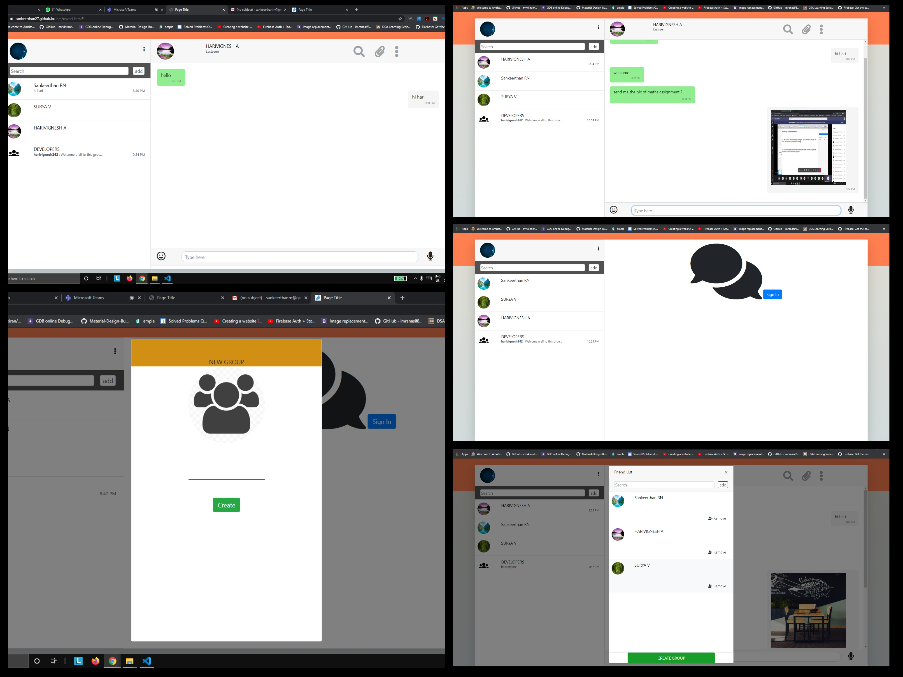

# JAM_Web_APP
 
# Revolutionizing Digital Learning

**JAM** is an innovative application that bridges the gap between students and educators, fostering seamless interaction, efficient knowledge sharing, and collaborative learning. Designed with essential features for educational institutions and it is one-stop solution for classroom information sharing, testing, and much more.

## Web App ##

---

## 🌟 Highlights

### **Jam Chat**
- Communicate with ease! Engage in one-on-one conversations or participate in organized group discussions.
- Share **text**, **audio**, **videos**, and various file types to collaborate efficiently.

### **Jam Feed**
- A platform to showcase your ideas and accomplishments to peers.
- Features like **likes** and **comments** encourage recognition and motivation.
- Your feed activity can serve as a **portfolio** during placement screenings to highlight your skills.

### **Jam Quiz**
- Teachers can create quizzes with **MCQs** or **True/False** questions.
- Detailed performance reports are generated for students and admins:
  - **Admin**: Excel reports of group results.
  - **Students**: Individual performance insights.

---

## 🚀 Upcoming Add-ons

### **Jam Forum**
- An open Q&A space where students and teachers can exchange ideas and seek solutions to their questions.

### **Jam Club**
- Manage college clubs effortlessly with a dedicated space for club activities and events

### **Jam Website**
- Enjoy all features of  on the web, with the same intuitive experience as the app.

---

## 🔒 Security and Reliability
Jam  ensures **top-notch security** by leveraging **Google Cloud Platform** for data storage, providing a secure and scalable environment for your information.

---

## 🌐 Why Choose JAM?
With the growing inclination of the education system toward technology, Jam is more than just an app:
- It’s an essential tool for **hybrid learning environments**.
- It supports institutions in adapting to both in-person and remote education needs.

---

## 📚 Getting Started
To explore the features of JAM:
1. Create an account as a **student**, **teacher**, or **admin**.
2. Dive into a seamless learning and teaching experience.

---

## 📈 Roadmap
- ✅ Chat and file-sharing functionality
- ✅ Personalized feeds with likes and comments
- ✅ Quiz creation and detailed performance analytics
- 🚧 Integration of forums, club management, and file vaults
- 🚧 Web version enhancements

---
